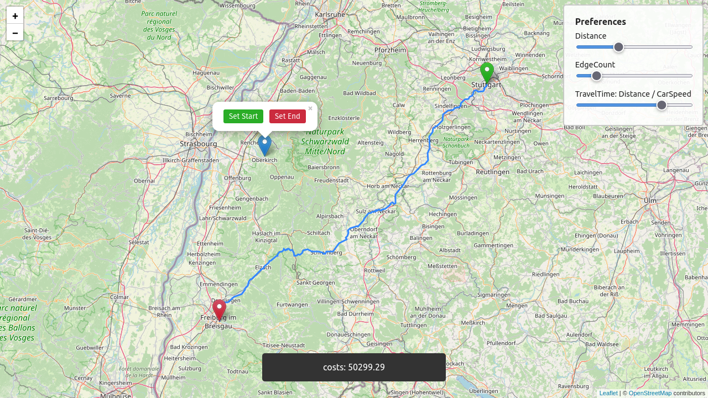

# Personalizable Route Planning (PRP)

based on [related work](https://ad-publications.cs.uni-freiburg.de/GIS_personal_FS_2015.pdf) using [OSM](openstreetmap.org/) data. download `osm.pbf` files from [geofabrik](https://download.geofabrik.de/)



## Compile

```bash
git submodule update --init --recursive
cargo build --release
```

## Extract OSM-data

```shell
cargo run --bin pbfextractor --release -- [path/to/pbf-file] [folder/with/srtm/files] [path/to/output/fmi-file(output)]
```

extracting largest connected set of node: (needed for Merge- & Gonzalez-partitioning)

```shell
cargo run --bin fmi_largest_set --release -- -i [path/to/fmi-file] -o [path/to/fmi-file(output)]
```

## [MLP (multi-level-partitioning)](https://en.wikipedia.org/wiki/Graph_partition#Multi-level_methods)

two methods possible:

- Merge

```shell
cargo run --bin mlp_merge --release -- -f [path/to/fmi-file] -o [path/to/mlp-file(output)] [-p/-s defining save points when merging e.g. -s 500 5000]
```

- Gonzalez

```shell
cargo run --bin mlp_gonzalez --release -- -f [path/to/fmi-file]  -o [path/to/mlp-file(output)] -p [partitions from top to bottom e.g. 50 100]
```

- K-Means

```shell
cargo run --bin mlp_kmeans --release -- -f [path/to/fmi-file]  -o [path/to/mlp-file(output)] -p [partitions from top to bottom e.g. 50 100]
```

## Pre-computation

```shell
cargo run --bin prp_pre --release -- -f [path/to/fmi-file] -m [path/to/mlp-file] -o [path/to/bin-file(output)]
```

this may take some time

## Run

- web-server via:

```shell
cargo run --bin prp_web --release -- -f [path/to/bin-file] -q prp
```

- evaluation-tool via: (evaluation file can be generated with `helper/generate-eval-file.py`)

```shell
cargo run --bin prp_eval --release -- -f [path/to/bin-file] -e [path/to/eval_file] -t check -q prp
```

